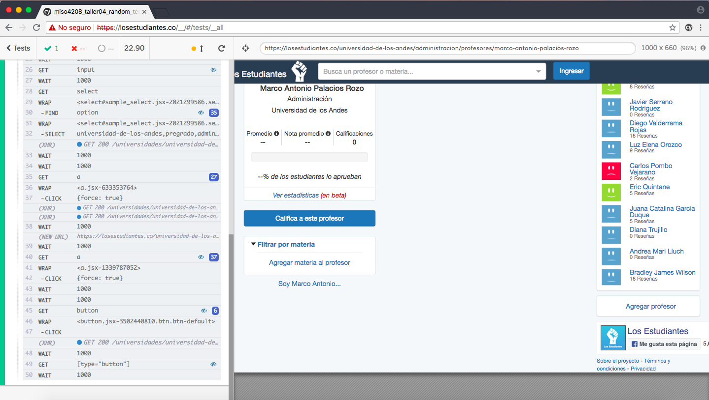
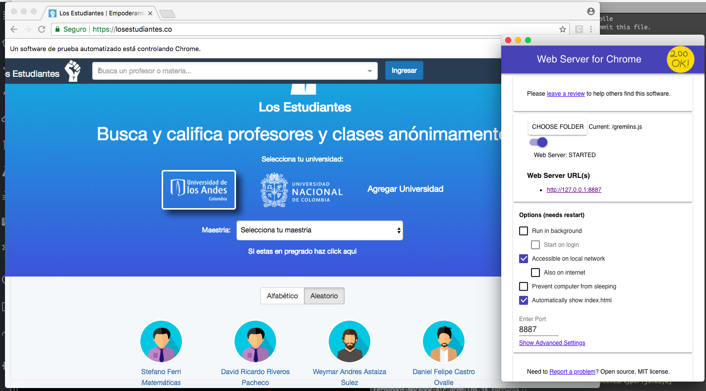
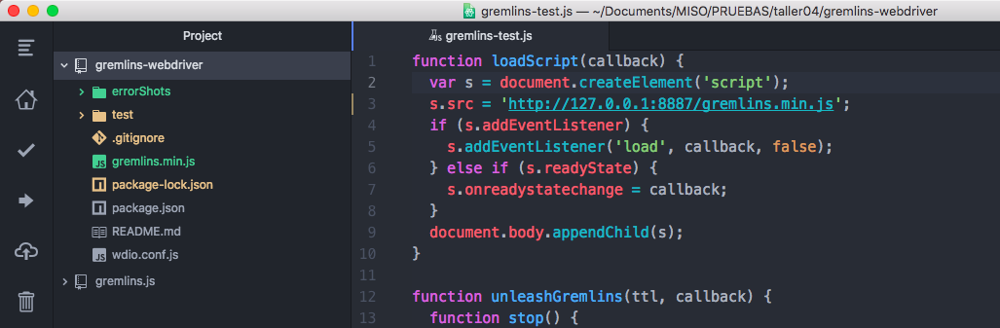
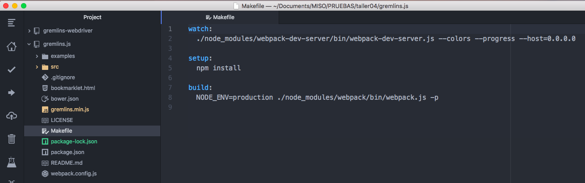
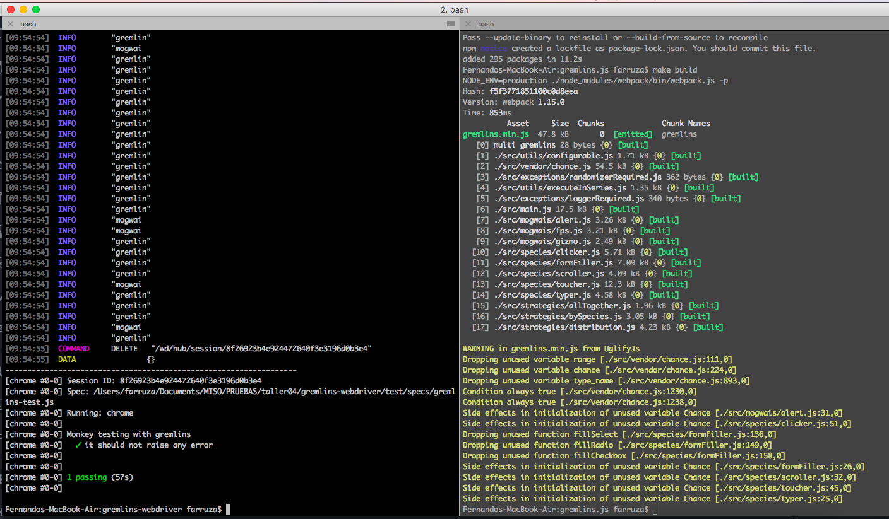

# TALLER 4: Random Testing.

## Cypress

## Gremlins
En esta sección del taller se solicita realizar cambios de comportamiento en la librería **Gremlins.js**, por tanto, fue necesario publicar en un servidor local (Web Server for Chrome) el recursos **__gremlins.min.js__**, ver imagen 1.

Dicho recurso se referenció en la implementación de **Test**, ver imagen 2.

Después de realizar las modificaciones en el código de la librería **Gremlins.js** se requiere construir nuevamente el recurso **__gremlins.min.js__** utilizando el comando:
> make build

Ejecución de la prueba, ver imagen 4.

